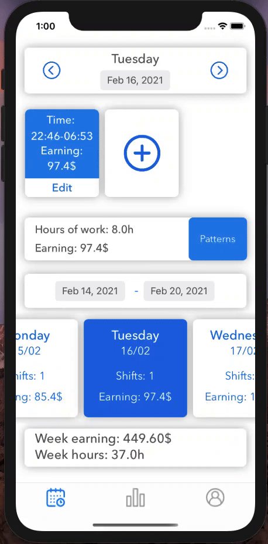

# shiftManager
Firebase  
SwiftEntryKit https://github.com/huri000/SwiftEntryKit  
Charts https://github.com/danielgindi/Charts   

**This is my first application dont be strick :)**  

**You can see statistic of your earnings**  
 

**When you had shifts**  

**Write your shifts**  
 

**Auth screens**  
 
